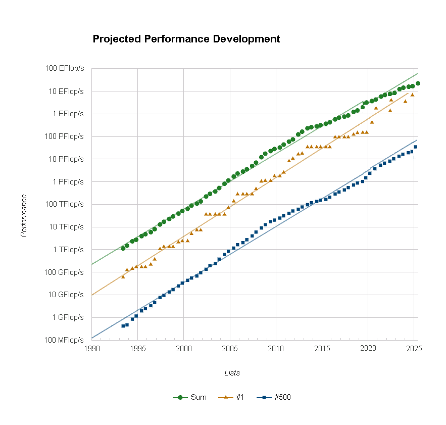

### 1) Эссэ на тему применения суперкомпьютеров в будущем.

Умение правильно проводить параллельные и высокопроизводительные вычисления всегда было очень ценно, потому что от того, на сколько быстро работает твоя программа может зависеть место в чемпионате по программированию, прибыль компании и многое другое. 

В настоящий момент постоянно растут мощности суперкомпьютеров, позволяющих сделать очень многое. В связи с этим в будущем может наблюдаться существенное увеличение их количества. В таком случае, потребуются специалисты, которые имеют опыт работы с ними и с какой-либо другой прикладной областью. Потенциально самым выгодным местом для применения суперкомпьютеров являются системы  каким-либо образом связанные с таким стремительно развивающимся направлением как машинное обучение и большие данные.  

В рамках этого направления может появиться какая-либо новая, возможно сделанная в виде веб-сервиса, система хранения и обработки  данных. С ее помощью было бы возможно еще быстрее проводить нужные для аналитики или обучения моделей  вычисления. Такая система могла бы так же хранить в себе наиболее часто используемые пайплайны разработки и  при этом иметь удобный интерфейс применения. На таком компьютере можно одновременно запускать множество  уже готовых моделей. Так же параллельно с использованием можно организовать сопровождение моделей с   периодическими доработками и автоматическим дообучением на на данных, которые так же автоматически  
собираются и загружаются в суперкомпьютер. 

Наличие такой машины у крупных корпораций или государств позволило бы им существенно продвинуться в различных областях науки, индустрии и бизнеса. 

* Это могли бы быть какие-то прорывы в медицине. Например удалось бы смоделировать и понять работу человеческого мозга. Возможно были бы подробнее изучены современные неизлечимые болезни и для каждой из них наконец изобрели бы лекарство.

* Возможно через несколько лет была бы смоделирована и успешно построена новая модель общества, не похожая на ранее описываемые в литературе антиутопии. Такие стремления и амбиции наверняка уже присутствуют у некоторых современных деятелей.

* Наконец появились бы полностью беспилотные средства передвижения, которые были бы доступны каждому человеку т.к. такие машины использовали бы обычные камеры для ориентирования в пространстве, а начинка была бы получена с помощью моделей обученных на суперкомпьютере. 

В итоге продолжающейся рост вычислительных мощностей (см. пункт 2 задания) суперкомпьютеров обязательно  будет постепенно обеспечивать прорывы в какой-либо области, что в каком-то смысле означает развитие человечества через обретение новых возможностей.

### 2) Прогноз вычислительных мощностей суперкопмьютеров #1 и #500

Проведя линейную экстраполяцию получим, что через 5 лет суперкомпьютеры будут иметь #1 100 EFlop/s и #500 PFlop/s  

